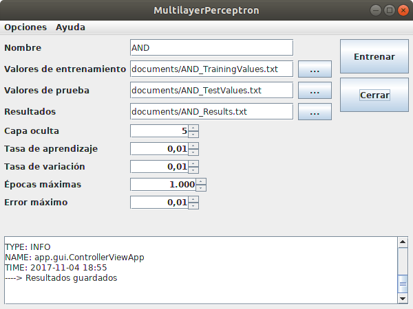

MultilayerPerceptron
====================

Descripción
-----------
Perceptrón Multicapa, red neuronal artificial.

- Copyright: 2014 Saúl Piña <sauljabin@gmail.com>
- Repository: https://github.com/sauljabin/multilayer-perceptron
- License: MIT
- Language: Java

Comandos
--------

```
make run

make clean
```

Screenshots
-----------



Resultados
----------


